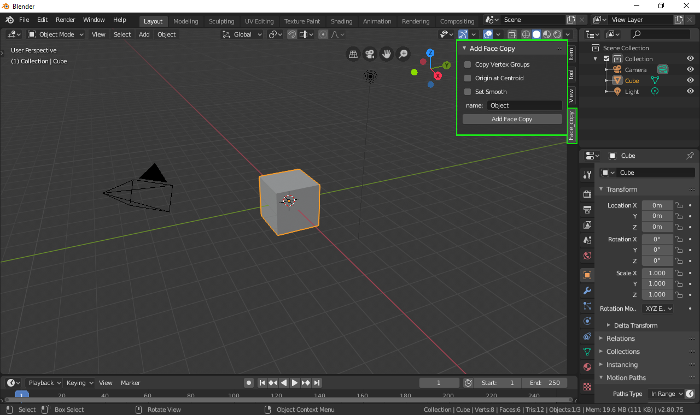
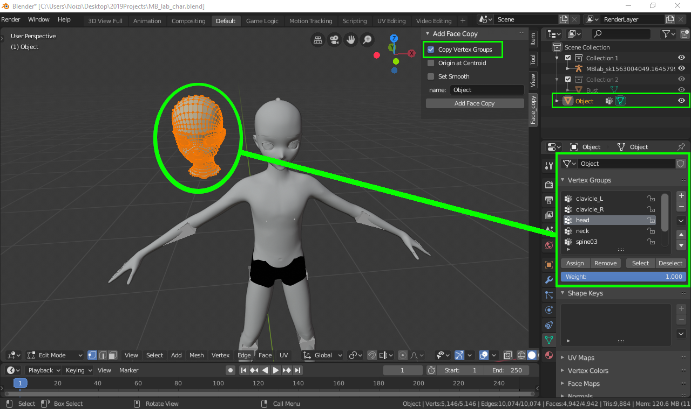
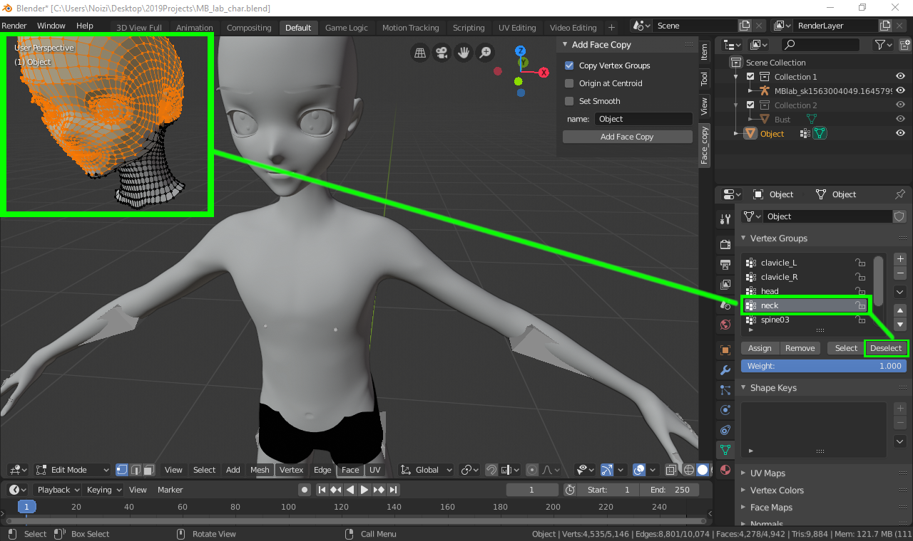
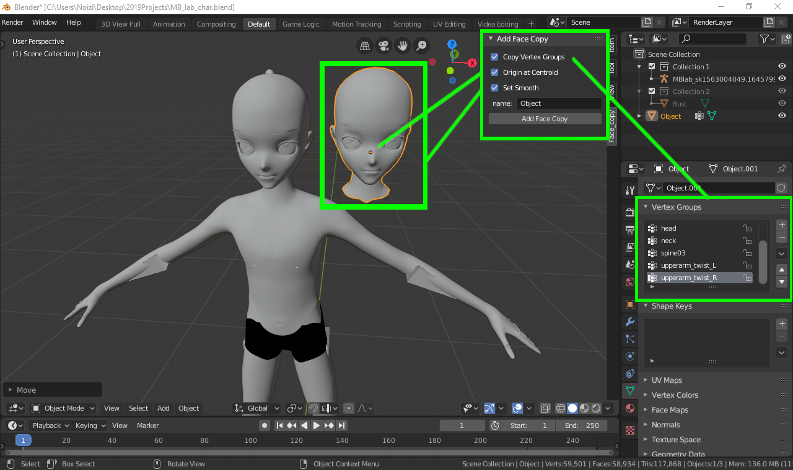

# Add_Face_Copy_Addon_ver2
This is a simple tool for Blender 2.80+ that makes a new object from copied mesh faces.

<!DOCTYPE HTML PUBLIC "-//W3C//DTD HTML 4.0 Transitional//EN">
<HTML>

<BODY LANG="en-US" DIR="LTR">

 

<OL>
  
<B>This
tool is located in the sidebar under the tab &ldquo;Face_copy&rdquo;.</B>

	
<B>Select
	desired faces from object in Edit Mode.</B>

	
<B>Check
	&ldquo;Copy Vertex Groups&rdquo; to copy over the Vertex Groups.</B>

	
 

	
 <B>Check
	&ldquo;Origin at Centroid&rdquo; moves the object origin to new
	centroid position.</B>

	
<B>Check
	&ldquo;Set Smooth&rdquo; to use smooth shading.</B>

	
<B>Type
	a name for the new object in the text field or keep the default
	name, &ldquo;Object&rdquo;.</B>

	

	
 

	

	
<B>That's
	it! Make as many copies as you need.</B>

</OL>

 

 

</BODY>
</HTML>
